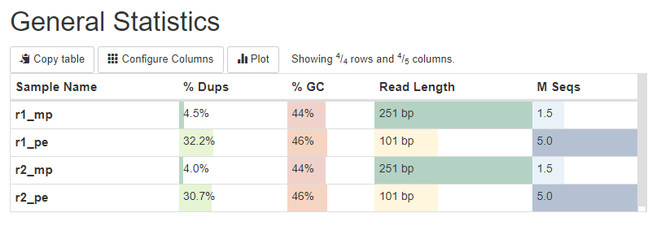
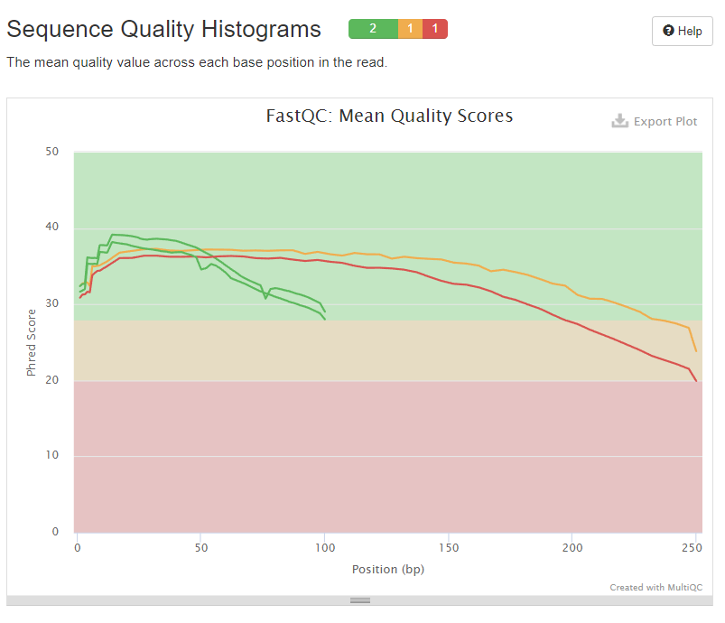
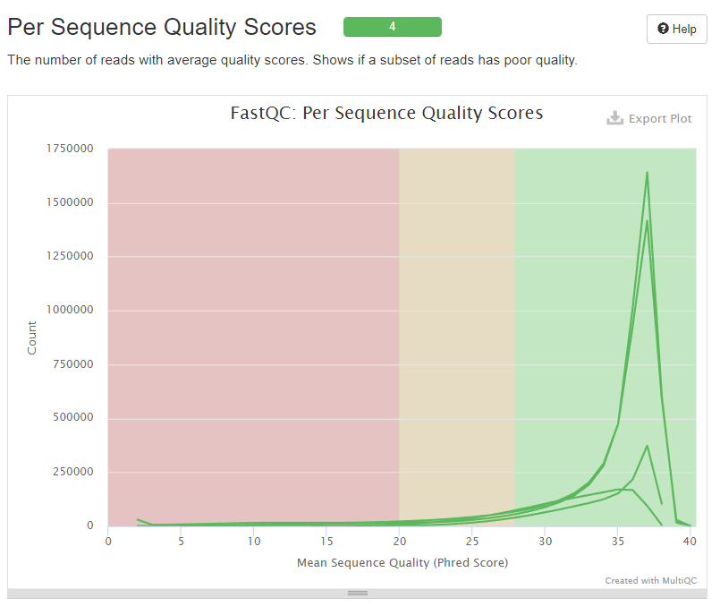
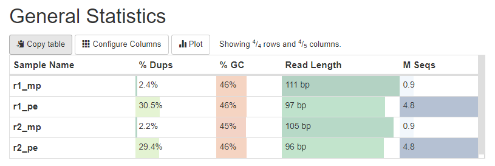
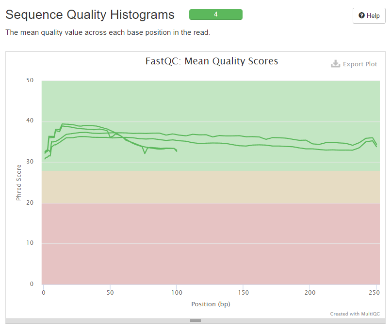

Берем случайные чтения

```
seqtk sample -s 116 oil_R1.fastq 5000000 > r1_pe.fastq
seqtk sample -s 116 oil_R2.fastq 5000000 > r2_pe.fastq
seqtk sample -s 116 oilMP_S4_L001_R1_001.fastq 1500000 > r1_mp.fastq
seqtk sample -s 116 oilMP_S4_L001_R2_001.fastq 1500000 > r2_mp.fastq
```

Запускаю fastQC, оцениваю качество, и multiQC, формирую отчет

```
mkdir fastqc      
ls *p.fastq *e.fastq | xargs -P 4 -tI{} fastqc -o fastqc {}  
mkdir multiqc      
multiqc -o multiqc fastqc
```

Отчет




Подрезаем значения

```
platanus_trim r1_pe.fastq r2_pe.fastq
platanus_internal_trim r1_mp.fastq r2_mp.fastq
```

Опять формируем отчет

```
mkdir Trim
ls *trimmed | xargs -tI{} fastqc -o Trim {}
mkdir multiqc2  
multiqc -o multiqc2 Trim
```

Отчет




Как можем увидеть, скор увеличился

Строим contigs, scaffold и gaps
```
platanus assemble -f r1_pe.fastq.trimmed  r2_pe.fastq.trimmed
platanus scaffold -c out_contig.fa -IP1 r1_pe.fastq.trimmed r2_pe.fastq.trimmed -OP2 r1_mp.fastq.int_trimmed r2_mp.fastq.int_trimmed
platanus gap_close -c out_scaffold.fa -IP1 r1_pe.fastq.trimmed r2_pe.fastq.trimmed -OP2 r1_mp.fastq.int_trimmed r2_mp.fastq.int_trimmed
```

### Бонус

Берем в 10 раз меньше данных

```
seqtk sample -s 116 oil_R1.fastq 500000 > small_r1_pe.fastq
seqtk sample -s 116 oil_R2.fastq 500000 > small_r2_pe.fastq
seqtk sample -s 116 oilMP_S4_L001_R1_001.fastq 150000 > small_r1_mp.fastq
seqtk sample -s 116 oilMP_S4_L001_R2_001.fastq 150000 > small_r2_mp.fastq

mkdir fastqc      
ls *p.fastq *e.fastq | xargs -P 4 -tI{} fastqc -o fastqc {}  
mkdir multiqc      
multiqc -o multiqc fastqc

platanus_trim small_r1_pe.fastq small_r2_pe.fastq
platanus_internal_trim small_r1_mp.fastq small_r2_mp.fastq

mkdir Trim
ls *trimmed | xargs -tI{} fastqc -o Trim {}
mkdir multiqc2  
multiqc -o multiqc2 Trim

platanus assemble -f small_r1_pe.fastq.trimmed  small_r2_pe.fastq.trimmed -o small
platanus scaffold -c small_contig.fa -IP1 small_r1_pe.fastq.trimmed small_r2_pe.fastq.trimmed -OP2 small_r1_mp.fastq.int_trimmed small_r2_mp.fastq.int_trimmed -o small
platanus gap_close -c small_scaffold.fa -IP1 small_r1_pe.fastq.trimmed small_r2_pe.fastq.trimmed -OP2 small_r1_mp.fastq.int_trimmed small_r2_mp.fastq.int_trimmed -o small
```
Скаффолодов стало больше но их длины уменьшились.
Суммарная длина и количесвто гэпов увеличилось.
